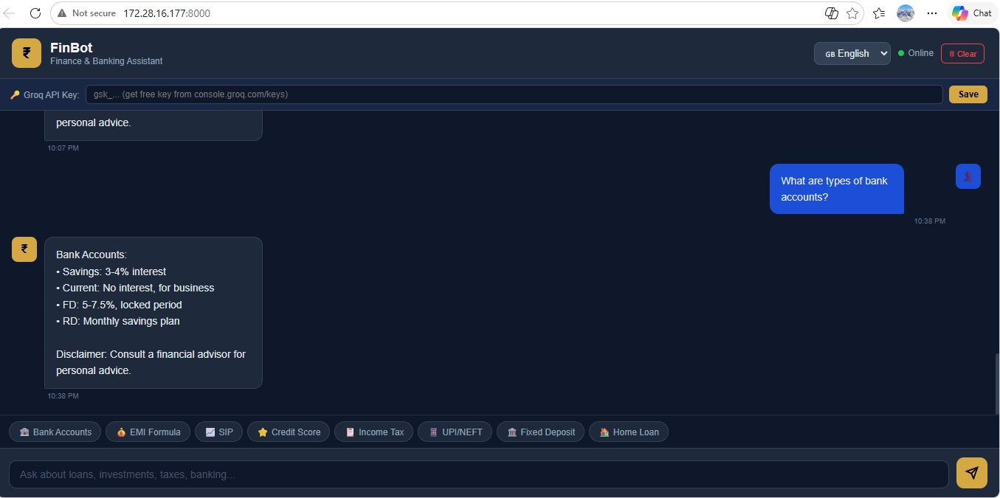
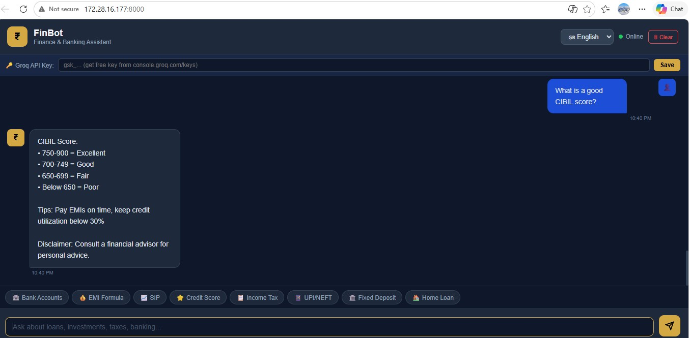

# FinBot – AI Finance Chatbot

FinBot is an AI-powered finance and banking assistant chatbot built using **Python Flask and Groq API**.  
It helps users understand financial topics like **credit score, EMI, SIP, loans, taxes, and investments** through a conversational interface.

---

## Features

- AI powered finance chatbot
- Credit score explanation
- EMI guidance
- SIP investment help
- Banking and tax information
- Interactive chat interface
## 📷 Project Screenshots

### Chatbot Interface

### Credit Score Response

---

## Tech Stack

- Python
- Flask
- HTML
- CSS
- JavaScript
- Groq API

- ## 🌐 Live Demo

https://finbot-flask-chatbot.vercel.app

---
